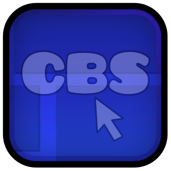

# CBS Indicator
A simple mod that makes it very obvious someone's using CBS (Click Between Steps)

## Why?
Geometry Dash 2.208 added Click Between Steps (CBS) and Click on Steps (CoS) to the base game. With that addition, my [CBF Indicator](https://github.com/xblazegmd/cbf-indicator) mod became useless as that mod was made specifically for syzzi's [Click Between Frames](https://geode-sdk.org/mods/syzzi.click_between_frames) mod, which also became useless. This mod ports the functionality of my CBF Indicator mod to RobTop's CBS and CoS.

## License
This mod is licensed under the **MIT License**. More information about it can be found [here](https://choosealicense.com/licenses/mit/).
